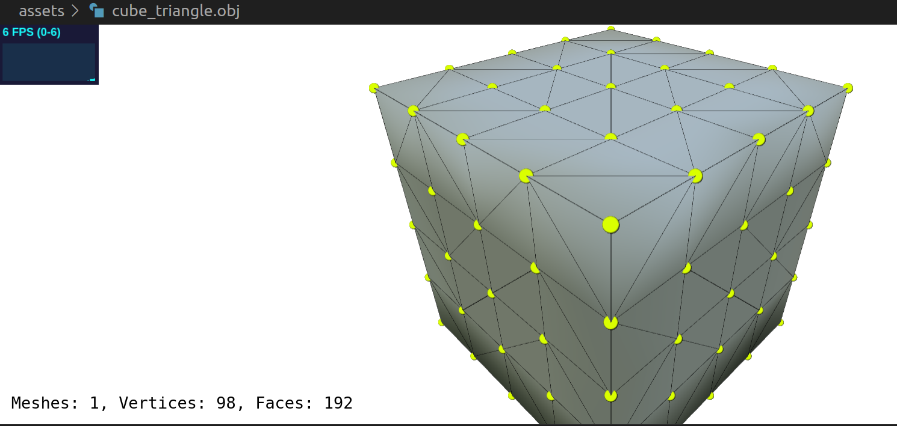
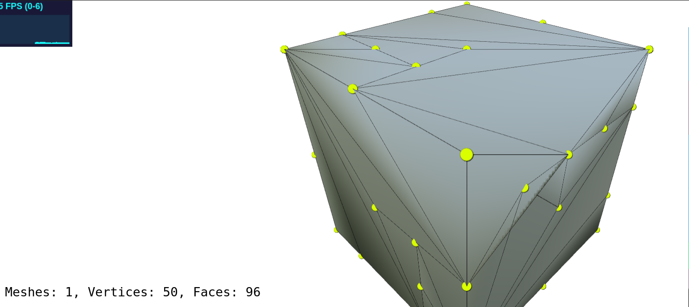
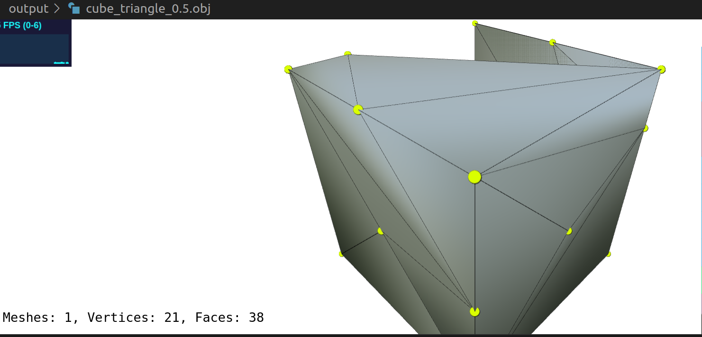
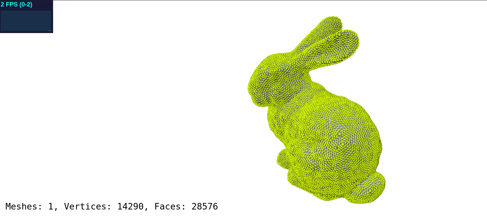
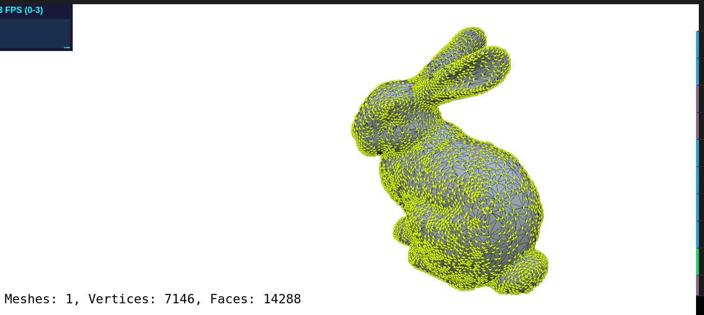
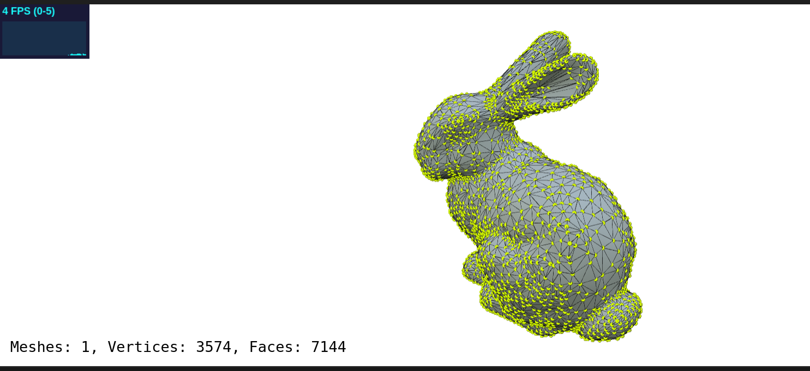

# Project-2: Mesh Simplification

## 1. 代码明细
```
.
├── assets
├── build
├── CMakeLists.txt
├── external
├── image
├── meshark
├── output
├── README.md
└── report.md


```


output下储存*complex_bunny*和*cube_triangle*分别使用 0.5与0.25的简化率的输出文件。


report为本次的实验报告。
## 2. 环境配置
本次环境在unbutu20.04环境下，g++的较低版本无法支持c++20的最新特性，所以指定使用g++-10。

## 3. 程序编译及运行命令
```bash
# 1. 进入/创建构建目录并清理旧缓存
rm -rf build
mkdir build && cd build

# 2. 指定编译器并生成 Makefile

cmake -DCMAKE_CXX_COMPILER=g++-10 ..

# 3. 编译项目
make -j$(nproc)
```
编译完成之后,在项目文件夹下使用命令如下：
```bash
# 参数顺序通常为：[输入文件] [输出文件] [保留比例]
./build/meshark/simplify assets/complex_bunny.obj output/complex_bunny_0.25.obj 0.25
```

## 4. 算法实现与实验结果

### 4.1 半边表迭代器实现

在半边数据结构中，我们需要遍历一个顶点的所有邻边来访问其邻居。在 `VertexElement` 类中，定义了一个名为 `OutgoingHalfEdgeRange` 的迭代器。该迭代器的 `operator++` 函数实现了沿着顶点周边半边循环的逻辑：

- 当前半边 `it` 移动到下一个半边时，我们先通过 `it->twin` 跳到相邻面，然后再通过 `->next` 继续按逆时针方向遍历。代码大致为：  
```cpp
  it = it->twin->next;
  if (it == start) it = nullptr; // 如果回到起点，结束遍历
```
### 4.2 QEM 矩阵与代价计算
computeQuadricMatrix(Vertex v)：该函数负责计算顶点 v 周围面的二次误差矩阵 $Q_v$。具体步骤为：

- 对于顶点 v 的每个邻接面 $f$，获取该面在空间中的法线向量 $n = [a,b,c]^T$。同时根据顶点坐标和法线计算平面方程：$d = -n \cdot v_{pos}$。

- 将平面参数 $p = [a,b,c,d]^T$ 构造成四维向量，并计算平面二次误差矩阵 $K_p = p p^T$。

- 将所有邻接面对应的 $K_p$ 相加得到顶点的累积二次误差矩阵 $Q_v = \sum K_{p,f}$。

- 返回该 $4\times 4$ 矩阵 $Q_v$，用于后续坍缩代价的计算。

computeOptimalCollapsePosition(Edge e)：该函数用于计算坍缩边 e=(v1,v2) 后最佳的顶点位置 $\bar{v}$：

- 首先取边两端顶点的二次误差矩阵 $Q_1$ 和 $Q_2$，并求和得到 $Q_{sum} = Q_1 + Q_2$。

- 构造矩阵 $A$，它由 $Q_{sum}$ 改造而来：将第四行设为 [0,0,0,1]，以形成线性方程 $A \bar{v} = [0,0,0,1]^T$。该方程的求解给出最优位置的齐次坐标。

- 若矩阵 $A$ 可逆（行列式不接近零），则直接求解线性方程 $A^{-1}[0,0,0,1]^T$，得到新的齐次坐标 $\bar{v}$，最终取其前三分量作为最优位置。

- 若 $A$ 不可逆（退化情况），说明无法通过线性求解得到唯一解，此时退而考虑边端点和中点三者的位置：分别计算端点 $p_1,p_2$ 和中点 $p_{mid}$ 在 $Q_{sum}$ 下的代价值 $p^T Q_{sum} p$。选择使得代价最小的位置作为新的顶点坐标。返回选定的 $\bar{v}$。

### 4.3 拓扑操作：边坍缩

collapseEdge 函数负责执行一次边坍缩操作，将边 e_keep=(v_keep,v_remove) 从网格中合并并删除。其主要流程包括：

- 指针重定向：将要删除的顶点 v_remove 的所有出边（和对应的对边）重定向到保留顶点 v_keep。即对于每条连接到 v_remove 的半边，将其 tail 指向 v_keep，并相应地更新其对边的 tip 为 v_keep。

- 半边缝合：坍缩一条边会使左右两个三角面退化，需要缝合两侧相邻的半边。具体做法是将退化三角形的两条未坍缩的半边互为对偶（twin）并关联到合并后的边上。此外要更新相应半边所指向的 edge 对象，保证几何和拓扑结构一致。

- 删除冗余元素：删除产生退化的面和边，包括被坍缩的边 e 以及对应面中不再使用的边。在删除过程中，需要特别注意顺序：先从优先队列的辅助数据结构中移除该边，再调用网格的 removeEdge 方法，同时更新其他元素的索引。这样可以避免索引错乱或野指针。

总体而言，collapseEdge 通过仔细管理半边指针（tail、tip、twin 等）和正确删除数据，保证网格仍保持流形结构且无悬空指针。此操作完成后，保留顶点 v_keep 的新位置由前述的最优位置计算函数确定。

### 4.4 级联更新

当某条边被坍缩后，其关联顶点的属性（如位置和二次误差矩阵）发生变化，需要级联更新与之相连的其他边的坍缩代价。updateVertexPos 函数实现了这一逻辑：

- 更新顶点位置：首先将顶点 v 的位置更新为新的计算值 pos。

- 收集受影响顶点：除更新顶点 v 外，还需要将所有与 v 相连的顶点（通过出半边访问）加入待更新集合。

- 更新二次误差矩阵：对所有受影响顶点 u，重新计算其二次误差矩阵 $Q(u)$。这反映了顶点位置变化后周围面的几何变化。

- 收集并更新边代价：利用自定义比较器的 std::set 收集所有受影响顶点所连的边，避免重复。对于这些边，重新计算坍缩代价，并通过 updateEdgeCost 更新到优先队列中。

通过这一步骤，可以保证在每次顶点位置改变后，所有相关边的代价都能得到及时更新，从而保持坍缩过程的正确性和贪心性质。

### 4.5 结果展示
简单起见，对测试模型*complex_bunny*和*cube_triangle*完成了简化。简化后的 OBJ 文件保存在 output/ 目录下，可直接 通过 VScode 的 mesh-viewer 插件查看。
简化前效果图如下
0.5简化率简化后效果图如下：
0.25简化率简化后效果图如下：
简化前效果图如下：
0.5简化率简化后效果图如下：
0.25简化率简化后效果图如下

在简化率为0.5的时候还可以看到基本不影响物体的本身的细节，在简化率为0.25时，可以看到大量细节丢失，影响观感。